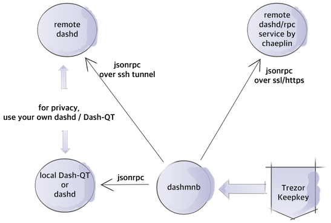
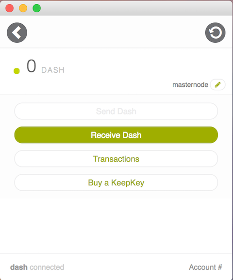
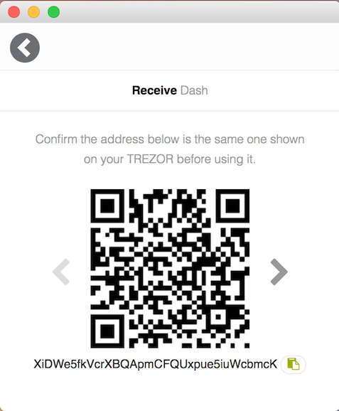
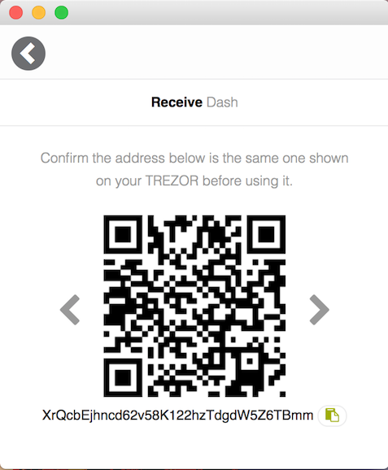

Run Dash Masternode with Hardware Wallet
=========================================

#### MAINNET READY ####
    - start mn working
    - sending payout working

###### Blocks



###### Q : why firmware update ?
    - to support Dash testnet, both trezor and keepkey has only Mainnet.
    - with Mainnet, no need to update firmware. Use official firmware.

###### Q : which hw wallet supported ?
    - Trezor
    - Keepkey
    - dashmnb will not run without hw wallet

###### Q : what can dashmnb do
    - config check (alias, address, ip, key, pkey, hw wallet path)
    - start masternode missing, selected
    - show masternode status
    - send payout in hw wallet
    - send collateral + coins(mn payment) in hw wallet
    - ssh tunnel to use remote dashd
    - can use remote rpc service

###### Q : why Dash-QT or dashd needed ? [if you want to run your own dashd/QT]
    - if you use `remote dashd/rpc service` don't need
    - instead of block explorer 
    - to check address, collateral, masternode status
    - to get unspent tx of collateral
    - to relay mnb and txs

###### Q : why do -reindex ? [if you want to run your own dashd/QT]
    - if you use `remote dashd/rpc service` don't need
    - -reindex means restaring dashd or Dash-QT with -reindex option
    - after initial checking of masternode config, dashmnb will ask you to do reindex


###### Q : Which one to do first [if you want to run your own dashd/QT]
    - if you use `remote dashd/rpc service` don't need
    - Set up remote node(or masternode), add following to dashd.conf. check dash.conf.sample

```
    rpcuser=dashrpc#change
    rpcpassword=veryvey-long-complicatedpassword=#change
    rpcallowip=127.0.0.1
    rpcbind=127.0.0.1
    rpcport=9998
    server=1
    daemon=1
    logips=1
    addressindex=1
    spentindex=1
    timestampindex=1
    txindex=1
```

    Run once with dashd/QT with -reindex, to make index


###### Q : how 'remote dashd/rpc service' works ?
    - using nginx as proxy
    - lua script by https://github.com/adetante/ethereum-nginx-proxy
    - need to change version checking
    - use ssl by default
    - add http basic auth to nginx
    - change Authorization header using proxy_set_header
    - rpc user name and password on config.py is only for web auth
    - use remote rpc service
    - use dashlib/config.sample.mainnet.remotesvc.py


###### config.py example
    - using emote rpc service by chaeplin

        cd dashmnb
        . venv3/bin/activate
        cp config.sample.mainnet.remotesvc.py dashlib/config.py

    - edit config.py

```
# https://github.com/bitcoin/bips/blob/master/bip-0044.mediawiki
# purpose' / coin_type' / account' / change / address_index
# Dash  : 44'/5'/account'/0/0
# tDash : 44'/165'/account'/0/0
# bip32 path
# 1 is selected to use trezor's web wallet and Keepkey's client
account_no = 1

# HW WALLET TYPE
# Keepkey [ keepkey ], Trezor [ trezor ]
TYPE_HW_WALLET = 'Trezor'          

# masternode_config
masternode_conf_file = 'masternode.conf'

# default address to send payout coins in hw wallet if reveiving_address in masternode.conf is blank.
# this is not changing payment address of mn
# command -m and -x will use
default_receiving_address = ''

#
# how many mns do you have, to check address on hw wallet
# if bip32 path last used address for mn is like 44'/5'/1'/0/10 : address_index is 10
# use max_gab = 11 (address_index + 1)
max_gab = 5     
```


## Installation

### 1. Install Prerequisites (Ubuntu/Debian)

Make sure Python version 3.5.1 or above is installed:

    python3 --version


Check python install script others/linux/Debian-Raspbian-python-3.5.3-install.sh


Update system packages and ensure virtualenv is installed:

    sudo apt-get update
    sudo apt-get install libudev-dev libusb-1.0-0-dev libfox-1.6-dev
    sudo apt-get install autotools-dev autoconf automake libtool
    sudo apt-get -y install python3-pip git
    sudo pip3 install virtualenv


### 1. Install Prerequisites (Mac oS)

Install brew and python3.5 or python3.6 

    /usr/bin/ruby -e "$(curl -fsSL https://raw.githubusercontent.com/Homebrew/install/master/install)"    
    brew install python3 git
    pip3 install virtualenv


### 2. Install dashmnb

Clone the dashmnb repo and install Python dependencies.

    git clone https://github.com/chaeplin/dashmnb && cd dashmnb
    virtualenv -p python3 venv3
    . venv3/bin/activate
    pip install --upgrade setuptools
    pip install -r requirements.txt

## 3. Update

    cd dashmnb
    . venv3/bin/activate
    git pull

    pip install --upgrade git+https://github.com/chaeplin/python-trezor
    pip install --upgrade git+https://github.com/chaeplin/python-keepkey


## 4. debug

    add DASHMNB_DEBUG=1 

    cd dashmnb
    . venv3/bin/activate
    DASHMNB_DEBUG=1 python bin/dashmnb.py


## Udev rule set up for linux

To use keepkey or trezor as normal user, do following

    sudo cp others/linux/51-* /etc/udev/rules.d/


## Configuration

### 1. copy dashlib/config.xxxx.py to dashlib/config.py and edit parameters
    
    - use dashlib/config.sample.mainnet.remotesvc.py to use remote rpc service by chaeplin
    
    - testing config.py : no output if config.py is ok

        cd dashmnb
        . venv3/bin/activate
        python dashlib/config.py


### 2.  Use python bin/hw-wallet-for-mn.py to get a list of address

        cd dashmnb
        . venv3/bin/activate
        python bin/hw-wallet-for-mn.py

```
(venv3) > python bin/hw-wallet-for-mn.py 
    ____             __  
   / __ \____ ______/ /_ 
  / / / / __ `/ ___/ __ \
 / /_/ / /_/ (__  ) / / /
/_____/\__,_/____/_/ /_/ 
                         
    __  ___           __                            __   
   /  |/  /___ ______/ /____  _________  ____  ____/ /__ 
  / /|_/ / __ `/ ___/ __/ _ \/ ___/ __ \/ __ \/ __  / _ \
 / /  / / /_/ (__  ) /_/  __/ /  / / / / /_/ / /_/ /  __/
/_/  /_/\__,_/____/\__/\___/_/  /_/ /_/\____/\__,_/\___/ 
                                                         
           _ __  __       __  ___       __   _       __      ____     __ 
 _      __(_) /_/ /_     / / / / |     / /  | |     / /___ _/ / /__  / /_
| | /| / / / __/ __ \   / /_/ /| | /| / /   | | /| / / __ `/ / / _ \/ __/
| |/ |/ / / /_/ / / /  / __  / | |/ |/ /    | |/ |/ / /_/ / / /  __/ /_  
|__/|__/_/\__/_/ /_/  /_/ /_/  |__/|__/     |__/|__/\__,_/_/_/\___/\__/  
                                                                         

            by : chaeplin

Network : MAINNET
===> trezor HW Wallet found
Use the numeric keypad to describe number positions. The layout is:
    7 8 9
    4 5 6
    1 2 3
Please enter current PIN: 

Passphrase required: 

Confirm your Passphrase: 

**** ====> use following address for 1K collateral of masternode
Dash address: 44'/5'/1'/0/0        XiDWe5fkVcrXBQApmCFQUxpue5iuWcbmcK
Dash address: 44'/5'/1'/0/1        XrQcbEjhncd62v58K122hzTdgdW5Z6TBmm
Dash address: 44'/5'/1'/0/2        XnSibMiJGcoQzCcku4fhR4wWNNfFBrye9h
Dash address: 44'/5'/1'/0/3        XwUXXWL5kUzJNPDAX2wjxnQYkGjJL5AGwg
```

###### for testnet

- Use output of python bin/hw-wallet-for-mn.py 


###### for mainnet

- Use trezor web wallet or keepkey rc clinet to compare address and send 1K Dash to an address of Account #2

- Use Account #1 for daily use

- To add Account #2, should send small amount to an address of Account #1

https://www.keepkey.com/2017/02/02/dash-now-public-beta/

https://blog.trezor.io/multi-currency-support-bitcoin-dash-and-zcash-in-trezor-wallet-7377d812112a#.36ft1p2c1







### 3. Set up remote node(or masternode), add following to dashd.conf. check dash.conf.sample [if you want to run your own dashd/QT]

    rpcuser=dashrpc#change
    rpcpassword=veryvey-long-complicatedpassword=#change
    rpcallowip=127.0.0.1
    rpcbind=127.0.0.1
    rpcport=9998
    server=1
    daemon=1
    logips=1
    addressindex=1
    spentindex=1
    timestampindex=1
    txindex=1

### 4.  Run once with -reindex, to make index [if you want to run your own dashd/QT]

        dashd -reindex

### 5.  add ssh key to remote mastrrnode [if you want to run your own dashd/QT]

https://www.digitalocean.com/community/tutorials/how-to-set-up-ssh-keys--2


### 6.  Move mnconf/masternode.conf.sample to mnconf/masternode.conf and edit

### 7.  Run dashmnb.py

        cd dashmnb
        . venv3/bin/activate
        python bin/dashmnb.py


###### Thanks to
- codes form https://github.com/dashpay/electrum-dash
- ref : https://github.com/dashpay/dash/blob/v0.12.1.x/dash-docs/protocol-documentation.md by 

